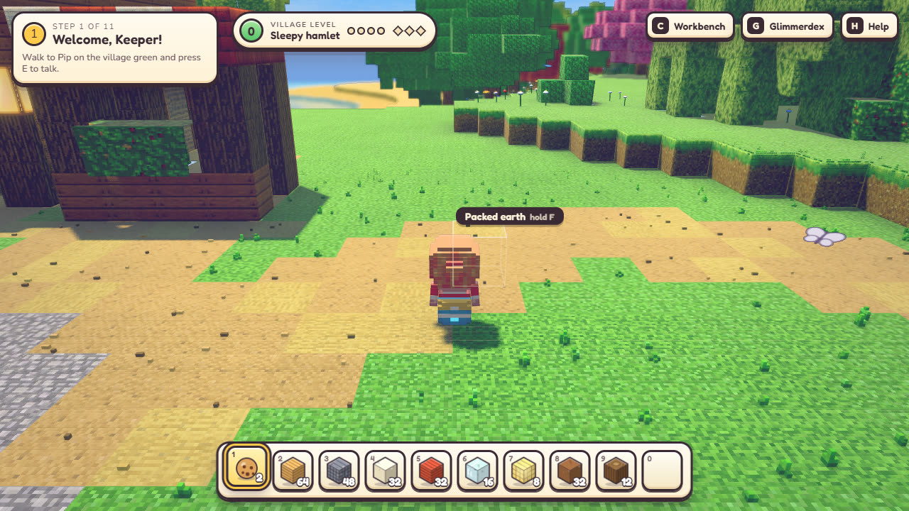
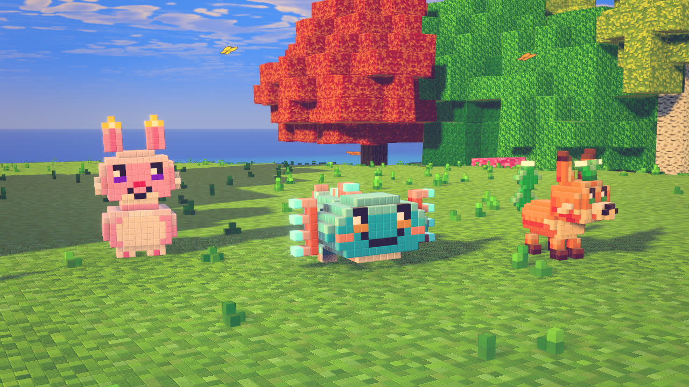

<h1 align="center">Glimmerwick</h1>

<p align="center">
  <b>A cozy open-world village sandbox. Explore a voxel island, befriend glowing critters called Glimmers,<br>
  build your village block by block, and bring a dimming lighthouse back to life.</b>
</p>

<p align="center">
  
</p>

<p align="center">
  <sub>Early prototype. Everything below is in the game today unless it is listed under <a href="#roadmap">Roadmap</a>.</sub>
</p>

---

## The game

You arrive on Glimmerwick, a small island whose lighthouse, the **Glimmerlight**, is slowly going dark. You are the new **Keeper**.
Start with a plot of land and a few empty cottages. Gather resources, build and upgrade your village, and make friends with the
island's Glimmers. As the village grows, new villagers move in and new corners of the island open up.

The loop is simple and keeps feeding itself:

**explore → collect → build → attract new friends → unlock new places → repeat**

Designed for ages 6–12 and anyone who likes cozy games: no combat, no ads, no loot boxes, no timers, no chat, no accounts.
Saves stay on your device.

<p align="center">
  
</p>

## What you can do today

- **Explore** a 352 × 288 m voxel island with beaches, meadows, forest, highlands, a pond and a village, under a real day and night cycle with weather.
- **Build.** Break and place blocks with a hotbar, craft at the workbench, and start with a builder's kit so you can build from the first second. Everything you build stays in the world.
- **Befriend Glimmers.** Three species (Puffbun, Tidler, Sprigfox), each in three colour variants, with moods, personalities and favourite treats. Offer a treat and a Glimmer can become your companion and follow you. Fill the **Glimmerdex** as you meet them.
- **Grow a village.** Place blocks near the green to raise the village level. Villagers (Pip, Bram, Marlo and Willa) move in as it grows, talk to you, and give you goals.
- **Follow a story.** An 11-step quest chain takes you from welcome to relighting the Glimmerlight.
- **Play your way.** Keyboard and mouse or a gamepad, a third-person camera that stays out of your way, and quality presets.

### Controls

| Action | Keys |
|---|---|
| Move / sprint / jump | `W A S D` / `Shift` / `Space` |
| Look | Mouse (click the game once to capture it), or `[` and `]` to turn from the keyboard |
| Pick an item | `1`–`0` or mouse wheel |
| Place a block | `X` or right-click |
| Break / chop | Hold `F` or click |
| Talk to a villager / offer a treat to a Glimmer | `E` |
| Workbench / Glimmerdex / help | `C` / `G` / `H` |
| Pause, release the mouse | `Esc` |

URL options: `?q=low|med|high|ultra` quality · `?intro=0` skip the intro · `?fresh=1` ignore the saved profile · `?ui=0` hide the HUD · `?story=0` turn the story off.

## Roadmap

- **Fine-voxel terrain.** Replace 1 m terrain blocks with tiny 1/16 m voxels, per-voxel colour, rounded relief and level-of-detail rings. The mesher (`crates/sim_micro`) is built and tested; browser rendering, LOD rings and cheap foliage come next.
- **Lens quests and companion abilities.** Real lens hunts, plus Glimmer abilities that open new areas (a hop-glide, a paddle boost, a sniff trail).
- **More of the world.** More biomes, more Glimmer species and variants, seasons, fishing and foraging.
- **Visit a friend's village.** Co-op visits with invite codes and preset emotes only, with no free-text chat.

## Run it

You need **Rust** (stable, 1.95 or newer) with the `wasm32-unknown-unknown` target and the matching `wasm-bindgen` CLI, **Node.js** (a recent LTS), and a browser with WebGL2 (Chrome or Edge).

```sh
git clone https://github.com/adi0900/Glimmerwick.git
cd Glimmerwick
(cd web && npm install)

# build the Rust simulation to WebAssembly (Windows / PowerShell)
powershell -File tools/build-wasm.ps1

# start the game
cd web && npm run dev          # http://localhost:5173/?view=game
```

If your Rust toolchain is not on `PATH`, run `. .\tools\env.ps1` (PowerShell) or `source tools/env.sh` (Git Bash) from the repo root first.

Checks: `cargo test --workspace` · `node tools/smoke-wasm.mjs` · `cd web && npm run typecheck` · `node tools/playtest-story.mjs`.

## How it is built

A headless **Rust + Bevy ECS** simulation compiled to WebAssembly owns the world, the player, the Glimmers and the rules. A **Three.js (WebGL2)** client renders the world, draws the interface and plays the audio. The two talk through a small, documented bridge.

| Crate (`crates/`) | Role |
|---|---|
| `sim_core` | Shared types, the command and query registries, saves, math |
| `sim_world` | The voxel world, terrain generation, biomes |
| `sim_player` | The controller (camera-relative movement, swimming, jumping, tools) |
| `sim_creatures` | Glimmer species, AI, moods, befriending |
| `sim_micro` | The fine-voxel mesher (levels of detail, ambient occlusion, skirts) |
| `sim_build`, `sim_systems` | Building, time, weather and the other systems |
| `bridge` | The WebAssembly boundary |

The web client (`web/src/modules/`) is a set of auto-discovered modules: `voxel`, `creatures`, `player`, `camera`, `atmosphere`, `hud` and `story`.

Start with [`docs/ARCHITECTURE.md`](docs/ARCHITECTURE.md), then [`docs/GAME_DESIGN.md`](docs/GAME_DESIGN.md), [`docs/STORY.md`](docs/STORY.md), [`docs/ART_BIBLE.md`](docs/ART_BIBLE.md) and [`docs/BRIDGE_API.md`](docs/BRIDGE_API.md).

## Original game

Glimmerwick's world, characters, Glimmers, story, names and art are original. It does not use assets, names or code from any other game or franchise. Libraries, tools and asset provenance are listed in [`docs/THIRD_PARTY.md`](docs/THIRD_PARTY.md), and the clean-room rules the project follows are in [`docs/CLEANROOM.md`](docs/CLEANROOM.md).

## License

No license has been chosen yet, so all rights are reserved by the author until one is added.
